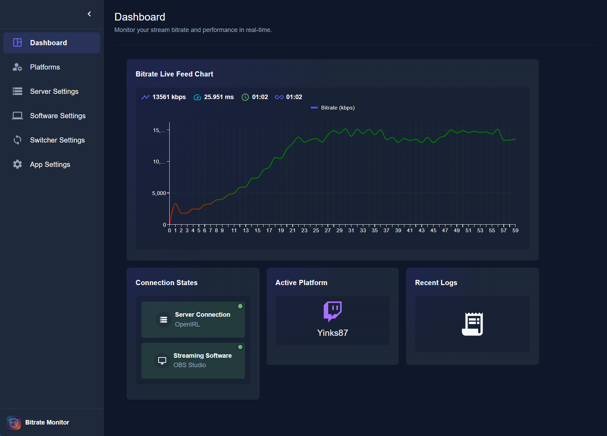

  <h1>
    DESKTOP BITRATE MONITOR
  </h1>
  <h2>
    A Desktop app to listen for SRT ingest server stats and change scenes in your broadcasting software.
  </h2>

### Why Desktop-Bitrate-Monitor

<ul style="list-style-type: none">
  <li >
    🌟 All settings and Tokens are saved on your local machine, no server security issues are possible
  </li>
  <li>
    🌟 User friendly interface
  </li>
  <li>
    🌟 Manage and customize all your chat messages and commands by yourself
  </li>
  <li>
    🌟 Multi platform support (Twitch, Kick)
  </li>
</ul>

# Quick Start Guide

- Download the "Desktop-bitrate-monitor-x.x.x-setup.exe file

  

- Execute and install the application 
  - It might be you have to accept the warning for security risks. This warning accurse because i don't have bought a "content-security-policy" to sign the app as secure
- Choose your platform and register your account
  - The enabled switch displays the current platform to listen for chat messages
- Setup your stats-server to listen for
- Connect your broadcasting software with the websocket (OBS-Websocket 5.x+ and higher)
  - If the connection credentials are correct, the app connection are automatically establishes
- If all correct connected, both connection state fields are green and the platform should display your account name

If you now start a SRT-Feed and the server publish stats you can see the current stats in the chart

# Dashboard

  
 Show all dashboard descriptions 

  
  <ol>
    <li>Navigation side panel with all navigation buttons</li>
      <ul>
        <li>Platform button opens a card to change the active platform and switch to the platform-settings</li>
        <li>Only one active platform are allowed</li>
        
      </ul>
    <li>Toggle navigation side panel</li>
      <ul>
        <li>State will stored in the config, after app restart the state are loaded again</li>
      </ul>
    <li>Full Feed-Chart</li>
      <ul>
        <li>Displays the live bitrate in a line chart</li>
      </ul>
    <li>Feed Stats</li>
      <ul>
        <li>The current feed-bitrate - refetching every 1000ms</li>
        <li>The current feed-speed - refetching every 1000ms</li>
        <li>The current feed-uptime - resets after restarting the feed</li>
        <li>The total feed-uptime - the sum of all single feed uptimes since the app starts, resets after app restart</li>
      </ul>
    <li>Connection states from the server and broadcasting software</li>
      <ul>
        <li>Color gray: No connection to a broadcasting software </li>
        <li>Color green: Broadcasting software is connected to the app</li>
        <li>Type: Show the server or broadcasting type if connected</li>
      </ul>
    <li>Current active platform to listen for chat messages</li>
      <ul>
        <li>Top: Shows the platform icon</li>
        <li>Bottom: Shows the Broadcaster nickname, is no broadcaster signed in for the active platform a information is shown instead the nick</li>
      </ul>
    <li>Open app session log feed</li>
  </ul>

# Platform Setup

