<div align="center">
  <h1>
    DESKTOP BITRATE MONITOR
  </h1>
  <h2>
    A desktop app that monitors SRT ingest server statistics and automatically switches scenes in your broadcasting software.
  </h2>
</div>

### Why Desktop-Bitrate-Monitor

<ul type="none">
  <li >
    🌟 All settings and tokens are stored locally on your machine — no server-related security risks
  </li>
  <li>
    🌟 User-friendly interface
  </li>
  <li>
    🌟 Fully customizable chat messages and commands
  </li>
  <li>
    🌟 Multi-platform support (Twitch, Kick)
  </li>
</ul>

<div align="center">
  <h2>
    If you have any, questions check the <span> <a href="#help-me">HELP ME - SECTION</a> to find solutions to common problems.</span>
  </h2>
</div>

# Quick Start Guide

- Download the "Desktop-bitrate-monitor-x.x.x-setup.exe file

  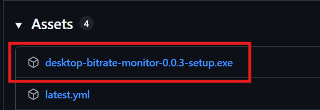

- Run the installer
  - You may see a security warning. This occurs because the app is not code-signed
- Select your platform and configure your account
  - The enabled switch shows which platform is currently active for chat listening
- Configure your stats server
- Connect your broadcasting software via WebSocket (OBS WebSocket 5.x or higher)
  - If credentials are correct, the connection will be established automatically
- If everything is connected properly:
  - Both connection indicators turn green
  - Your account name will be displayed

Once you start an SRT feed and the server publishes stats, you will see live data in the chart.

---

# Dashboard

<details>
  <summary> Show all dashboard descriptions </summary>
  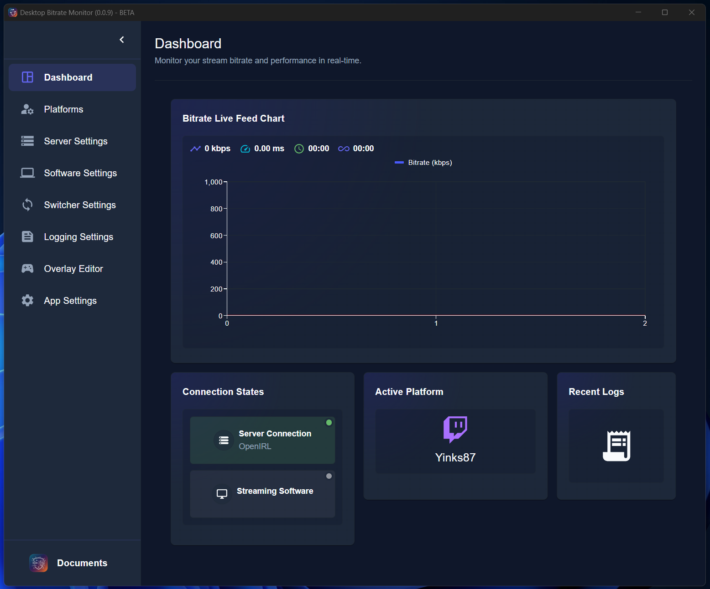
  <ol>
    <li>Navigation sidebar with all sections</li>
      <ul>
        <li>Platform button opens a card to change the active platform and switch to the platform-settings</li>
        <li>Only one active platform is allowed</li>
        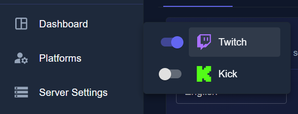
      </ul>
    <li>Toggle button for collapsing/expanding the sidebar (state is saved)</li>
    <li>Full Feed-Chart</li>
      <ul>
        <li>Displays the live bitrate in a line chart</li>
      </ul>
    <li>Feed statistics:</li>
      <ul>
        <li>Current bitrate - refetching every 1000ms</li>
        <li>Current speed - refetching every 1000ms</li>
        <li>Current uptime - resets after restarting the feed</li>
        <li>The total uptime - resets when app restart</li>
      </ul>
    <li>Connection status:</li>
      <ul>
        <li>Gray: No connection</li>
        <li>Green: connected</li>
      </ul>
    <li>Active platform and broadcaster account name</li>
    <li>Session log viewer</li>
  </ul>

</details>

---

# Platform Setup

<details>
  <summary>Display all platform settings</summary>

  <div align="center">
    <ul>
      <li>
        Only <span><u><b>one</b></u></span> platform can be active at a time
      </li>
      <li>
        When switching platforms, the app automatically connects to chat if an account is available
      </li>
    </ul>
  </div>

### Chat Commands

- Commands are shared across all platforms
- Changes apply globally (aliases, roles, enabled state)

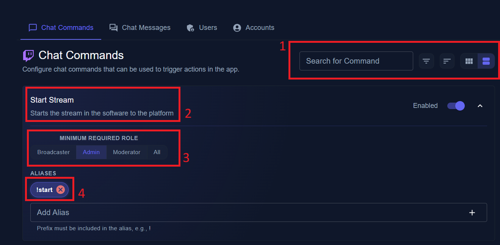

  <ol>
    <li>Search/Layout region</li>
    <ul>
      <li>
        All changed sorting/filtering/layout states are stored in the configs.
      </li>
      <li>
        Searchbox - Search commands by name or alias
      </li>
      <li>
        Filtering/Sorting - Sort and filter commands
      </li>
      <li>
        Layout - Switch between list and grid layout
      </li>
    </ul>
    <li>Command name</li>
    <ul>
      <li>
        The command name (searchable with the searchbox)
      </li>
    </ul>
    <li>Minimum required Role</li>
    <li>Aliases</li>
    <ul>
      <li>
        Each alias has his own chip
      </li>
      <li>
        Command alias has to be the first word
      </li>
      <li>
        The wanted prefix must be included in the alias, e.g. !start 
      </li>
    </ul>
  </ol>


- All commands for chat control
  <table>
    <thead>
      <tr>
        <th>COMMAND ACTION</th>
        <th>DESCRIPTION</th>
        <th>DEFAULT ALIASES</th>
        <th>ARGUMENTS </br> (required)</th>
        <th>EXAMPLE</th>
      </tr>
    </thead>
    <tbody>
      <tr>
        <td>startStream</td>
        <td>Starts the stream</td>
        <td>!start</td>
        <td></td>
        <td></td>
      </tr>
      <tr>
        <td>stopStream</td>
        <td>Stops the stream</td>
        <td>!stop</td>
        <td></td>
        <td></td>
      </tr>
      <tr>
        <td>addAdmin</td>
        <td>Adds a new admin</td>
        <td>!addadmin</td>
        <td>userName</td>
        <td>!addadmin yinks87</td>
      </tr>
      <tr>
        <td>removeAdmin</td>
        <td>Removes a existing admin</td>
        <td>!removeadmin</td>
        <td>userName</td>
        <td>!removeadmin yinks87</td>
      </tr>
      <tr>
        <td>addMod</td>
        <td>Adds a new moderator</td>
        <td>!addmod</td>
        <td>userName</td>
        <td>!addmod yinks87</td>
      </tr>
      <tr>
        <td>removeMod</td>
        <td>Removes a moderator</td>
        <td>!removemod</td>
        <td>userName</td>
        <td>!removemod yinks87</td>
      </tr>
      <tr>
        <td>switchToLive</td>
        <td>Switch to Live Scene</td>
        <td>!live</td>
        <td></td>
        <td></td>
      </tr>
      <tr>
        <td>switchToLow</td>
        <td>Switch to Low Scene</td>
        <td>!low</td>
        <td></td>
        <td></td>
      </tr>
      <tr>
        <td>switchToOffline</td>
        <td>Switch to Offline Scene</td>
        <td>!offline</td>
        <td></td>
        <td></td>
      </tr>
      <tr>
        <td>switchToPrivacy</td>
        <td>Switch to Privacy Scene</td>
        <td>!privacy</td>
        <td></td>
        <td></td>
      </tr>
      <tr>
        <td>switchToScene</td>
        <td>Switch Scene</td>
        <td>!switch, !ss</td>
        <td>sceneName</td>
        <td>!switch low</td>
      </tr>
      <tr>
        <td>refreshStream</td>
        <td>Refreshes the stream</td>
        <td>!refresh, !fix</td>
        <td></td>
        <td></td>
      </tr>
      <tr>
        <td>setTrigger</td>
        <td>Set the trigger to low threshold</td>
        <td>!trigger</td>
        <td>value</td>
        <td>!trigger 500</td>
      </tr>
      <tr>
        <td>setRTrigger</td>
        <td>Set the trigger to live threshold</td>
        <td>!rtrigger</td>
        <td>value</td>
        <td>!rtrigger 1200</td>
      </tr>
      <tr>
        <td>addAlias</td>
        <td>Set a alias for a command</td>
        <td>!addalias</td>
        <td>command, alias</td>
        <td>!addalias live !L</td>
      </tr>
      <tr>
        <td>removeAlias</td>
        <td>Removes a alias</td>
        <td>!removealias</td>
        <td>alias</td>
        <td>!removealias !L</td>
      </tr>
      <tr>
        <td>bitrate</td>
        <td>Returns the bitrate message</td>
        <td>!bitrate, !b</td>
        <td></td>
        <td></td>
      </tr>
    </tbody>

  </table>

##

### Chat Messages

- Messages are shared across all platforms
- Can be triggered :
  - Manually with command
  - Automatically via switcher events

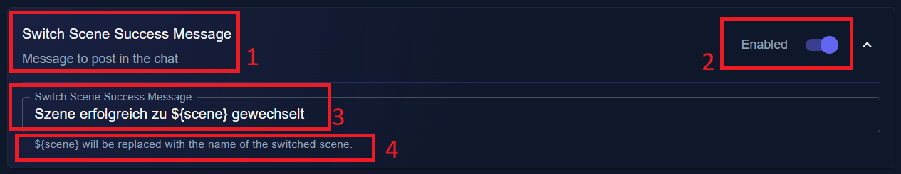

  <ol>
    <li>Message name</li>
    <ul>
      <li>
        The name from the message you can search for in the searchbox
      </li>
    </ul>
    <li>Enabled state</li>
    <ul>
      <li>
        If the message is disabled the message will not be posted
      </li>
      <li>
        The message text (with or without possible variables)
      </li>
    </ul>
    <li>Hint</li>
    <ul>
      <li>
        The hint with variable description. Variable format has to be exactly like the hints variable
      </li>
    </ul>
  </ol>

##

### User Settings

- Requires a logged-in broadcaster account
- Only public user data is requested from APIs
- Users added in the app do not need roles on the platform
- Platform moderators are automatically recognized as mods

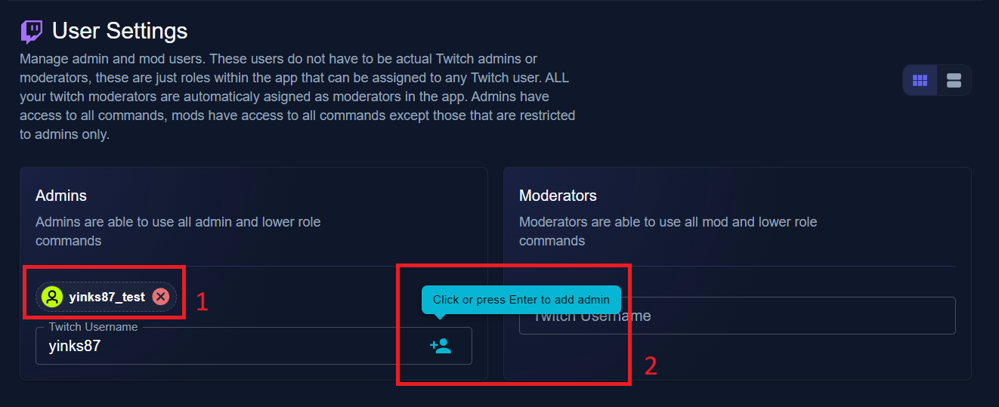

  <ol>
    <li>Users for the role-group</li>
    <ul>
      <li>
        List of users for each group
      </li>
      <li>
        Users are removed by click the cross in the users chip (User date deleted permanently)
      </li>
    </ul>
    <li>Add a user</li>
    <ul>
      <li>
        Entry the name from the user in the roles textfield. The name must exact match the users platform name
      </li>
      <li>
        After click the save button or press enter, the api call for the user data runs. If no user found a error message shown up, otherwise the chip for the user appears
      </li>
    </ul>
  </ol>

##

### Account Settings

- Broadcaster login for the active platform is a requirement
- Chatbot account is a option

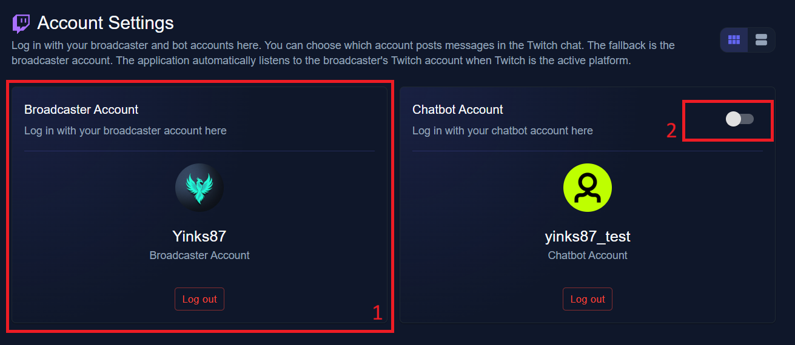

  <ol>
    <li>Account card</li>
    <ul>
      <li>
        The user information and logout button. After logout all userdata will be deleted and the user access token are revoked
      </li>
      <li>
        If no user is logged in, a login in button appears. After clicking the login button, the authorization code flow automatically starts in your machines main browser. After authorization, the user information is automatically stored in the app and the image and name of the user appears in the user card
      </li>
    </ul>
    <li>Enable Chatbot</li>
    <ul>
      <li>
        Set the toggle to enable to use the chatbot account to post messages in the platform chat
      </li>
    </ul>
  </ol>
</details>

---

# Server Setup

<details>
  <summary>Display all server settings</summary>

- The Bitrate Monitor is only able to listen for one server stats url

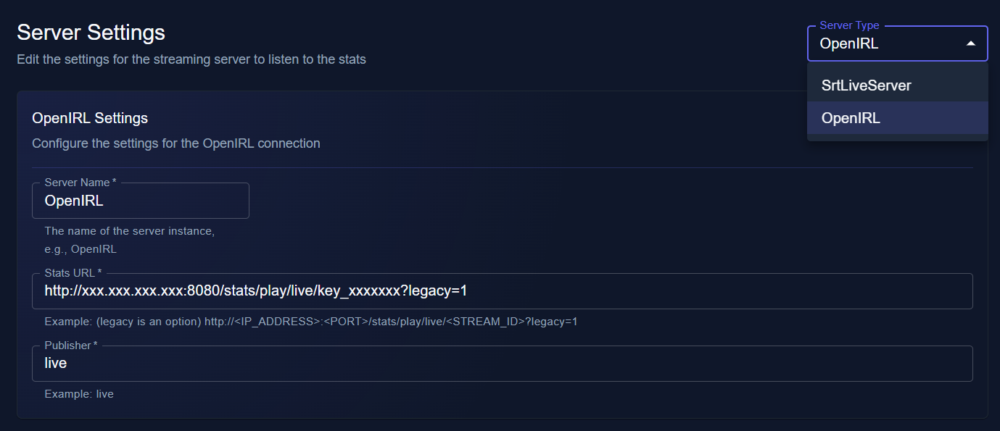

  <ol>
    <li>
      Server Type
    </li>
    <li>
      Server Name
    </li>
    <ul>
      <li>
        A random name
      </li>
    </ul>
    <li>
      Stats URL
    </li>
    <li>
      Publisher
    </li>
    <ul>
      <li>
        The publisher from your server stats
      </li>
    </ul>
  </ol>

</details>

---

# Software Setup

<details>
  <summary>Display all broadcasting software settings</summary>

- The broadcasting software is permanently connected with the app. In state of the feed information, witch are listen from the server stats, the Bitrate Monitor switches scenes in the broadcasting software

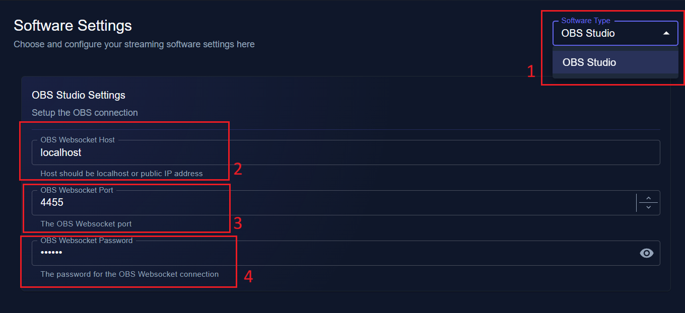

  <ol>
    <li>
      Software Type
    </li>
    <ul>
      <li>
        The broadcasting software type - Currently supports OBS Studio (more planned)
      </li>
    </ul>
    <li>
      Websocket Host
    </li>
    <ul>
      <li>
        The public or local address for the websocket
      </li>
    </ul>
    <li>
      Websocket Port
    </li>
    <ul>
      <li>
        The port from the Websocket
      </li>
    </ul>
    <li>
      Websocket Password
    </li>
    <ul>
      <li>
        Password (optional, may be called API token in some software)
      </li>
    </ul>
  </ol>

</details>

---

# Switcher Setup

<details>
  <summary>Display all switcher settings</summary>

- The switcher automatically changes scenes based on bitrate conditions.

##

### Switcher enabled states

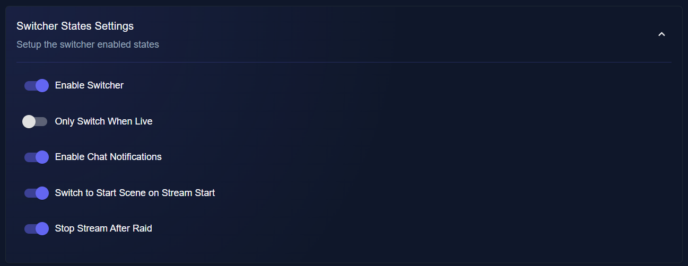

  <ol>
    <li>
      Enables Switcher
    </li>
    <ul>
      <li>
        Enable/disable the switcher
      </li>
    </ul>
    <li>
      Only switch when live
    </li>
    <ul>
      <li>
        Automatically switches only when broadcasting software state is live streaming
      </li>
    </ul>
    <li>
      Enable Chat notifications
    </li>
    <ul>
      <li>
        Enable/Disable chat outputs for automatic switches. Only enabled messages are able to use.
      </li>
    </ul>
    <li>
      Switch to start scene on stream start
    </li>
    <ul>
      <li>
        Automatically switch to start scene on trigger stream start with command (not broad)
      </li>
    </ul>
    <li>
      Switch from Start Scene to Live Scene
    </li>
    <ul>
      <li>
        Automatically switch to start scene disabled, manually switch required
      </li>
    </ul>
    <li>
      Stop stream after raid
    </li>
    <ul>
      <li>
        After raiding another broadcaster, the switcher automatically stops the stream in the broadcasting software
      </li>
    </ul>
  </ol>

##

### Switcher Scene Settings

- Setup the scenes for the switcher. The scene names must match the scenes in your broadcasting software. If they not matching, the switcher is not abel to switch to the scene

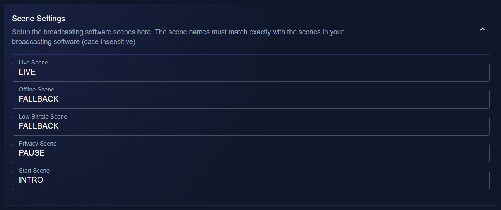

  <ol>
    <li>
      Live Scene
    </li>
    <ul>
      <li>
        The main live scene. This is the scene if bitrate threshold is in range to show the live picture in the stream
      </li>
    </ul>
    <li>
      Offline Scene
    </li>
    <ul>
      <li>
        The scene if the threshold is below the off-trigger value
      </li>
    </ul>
    <li>
      Low Bitrate Scene
    </li>
    <ul>
      <li>
        The scene if the threshold is below the live-trigger and above the off-trigger value
      </li>
    </ul>
    <li>
      Privacy Scene
    </li>
    <ul>
      <li>
        The privacy scene is a special scene for private moments. The switcher will never switch from the scene away if no manual event is triggered. The scene can be restricted as well, this means, the switch scene command can be restricted, so no one without the required permissions can switch away from the privacy scene. Switching to the privacy scene is not restricted.
      </li>
      <li>
      <b><u>This scene must have a unique name! No other scene can have the same name like the privacy scene!</u></b>
      </li>
    </ul>
    <li>
      Intro Scene
    </li>
    <ul>
      <li>
        The scene where the switcher switches if the "Switch to Start on Stream Start" option is enabled
      </li>
    </ul>
  </ol>
  
##

### Switcher Scene Settings

- Setup the trigger thresholds and the delays before the switcher switches the scene

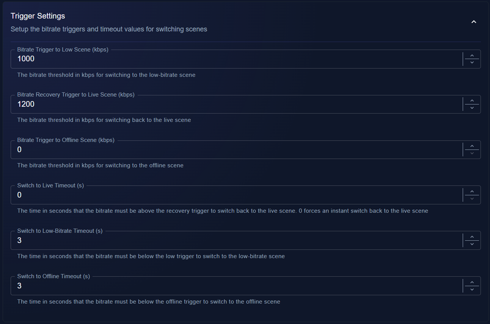

  <ol>
    <li>
      Bitrate Trigger to Low Scene
    </li>
    <ul>
      <li>
        If the current bitrate is equal or below this value, the switcher switches to the low-bitrate-scene after the delay time value.
      </li>
    </ul>
    <li>
      Bitrate Recovery Trigger
    </li>
    <ul>
      <li>
        If the current bitrate is equal or above this value, the switcher switches to the live-scene after the delay time value.
      </li>
      <li>
        If the delay time value set to 0, the switcher switch switches instant back to the live-scene
      </li>
    </ul>
    <li>
      Bitrate Offline Trigger
    </li>
    <ul>
      <li>
        The the current bitrate is equal or below this value, the switcher switches to the offline scene
      </li>
    </ul>
    <li>
      Switch to Live Timeout
    </li>
    <ul>
      <li>
        The time in seconds the current bitrate has to be above the bitrate threshold before the switcher actual switches the scene.
      </li>
      <li>
        Set the value to 0 to force instant recover to live scene
      </li>
      <li>
      </li>
    </ul>
    <li>
      Switch to Low Timeout
    </li>
    <ul>
      <li>
        The time in seconds the current bitrate has to be below the bitrate threshold before the switcher actual switches the scene
      </li>
    </ul>
    <li>
      Switch to Offline Timeout
    </li>
    <ul>
      <li>
        The time in seconds the current bitrate has to be below the bitrate threshold before the switcher actual switches the scene
      </li>
    </ul>
  </ol>

</details>

---

# Logging Setup

<details>
  <summary>Setup the logging settings</summary>

- Setup the logging for session feed logs and action logs
- The logs will be stored in the paths are defined

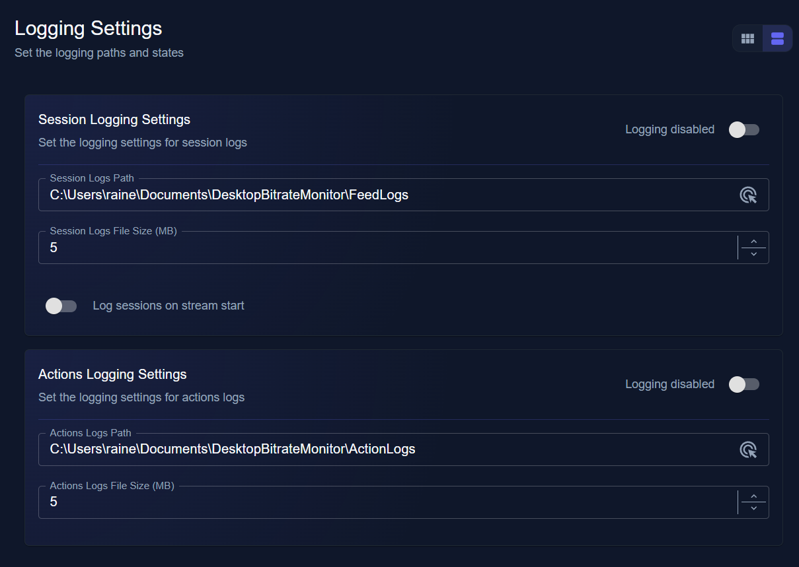

1. Session logging settings
   - Enable / disable the logging for session data
   - Path/Directory for log storing
   - Maximum file size for each log - logs are split after reaching the size
   - Setup logging starting point (App or Broadcasting start)

2. Actions logging settings
   - Enable / disable actions logging
   - Path/Directory for log storing
   - Maximum file size for each log - logs are split after reaching the size

</details>

---

# Overlay Setup

<details>
  <summary>Setup your Overlay</summary>

- Display your live feed stats in your stream
- Easy mode or expert mode available

### URL Settings

  <ol>
    <li>Change between Easy/Expert Mode</li>
    <li>Save changes and push them to your live overlay</li>
      <ul>
      <li>Unsaved changes are lost on change to another settings page</li>
      <li><b>NOTICE</b>Mode change need a save click to show the change in your live overlay!</li>
      </ul>
    <li>Drag & Drop the element to add a overlay automatically in your software</li>
    <li>Click the URL-Field to copy the URL to your clipboard</li>
    <li>Every change are show up in the preview in realtime</li>
    <li><b>Do not forget to save your changes to make them in your live overlay visible</b></li>

  </ol>

##

### Easy Mode

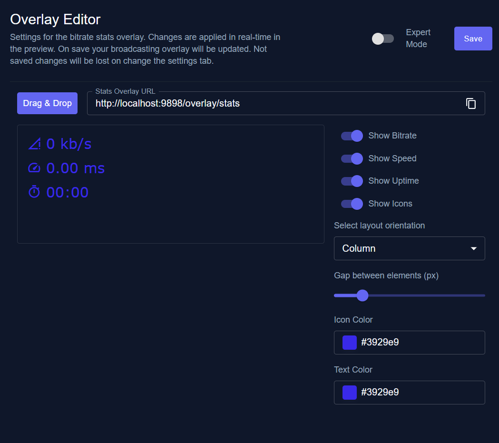

- Change the elements visibility
- Change some colors or directions

##

### Expert Mode

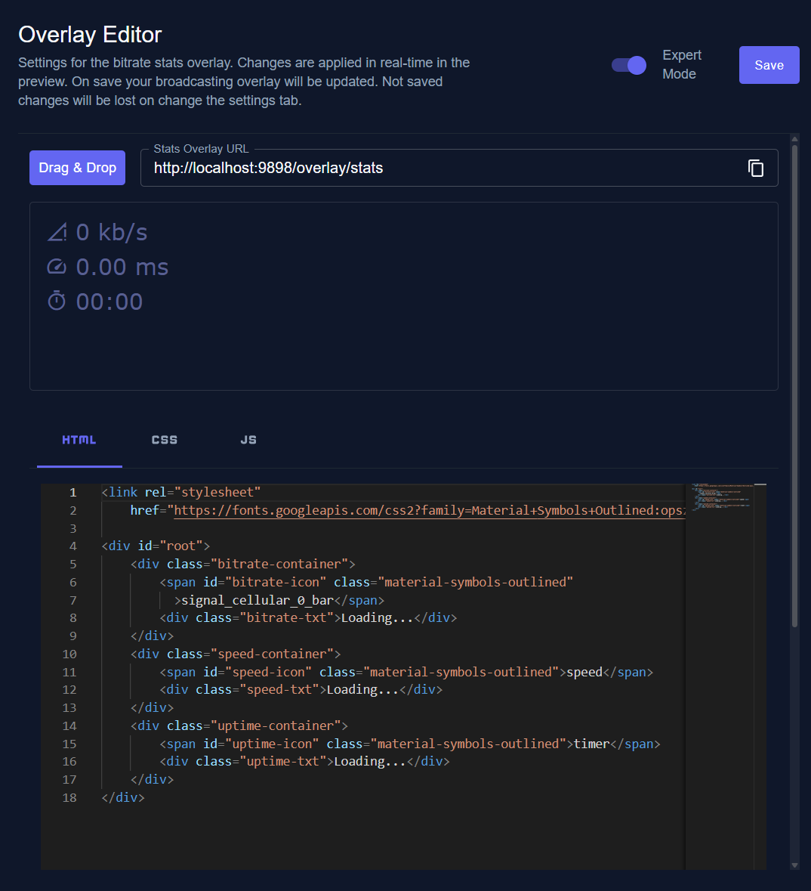

- Edit the overlay with raw HTML, CSS, JS
- jQuery is supported
- PROPS Object includes the default state values

```javascript
const { bitrate, speed, uptime } = PROPS;

// The current bitrate from the incoming feed
bitrate;
// The current speed (rtt) from the incoming feed
speed;
// The current uptime from the incoming feed
uptime;
```

</details>

---

# App Settings

<details>
  <summary>Display all general app settings</summary>

### General

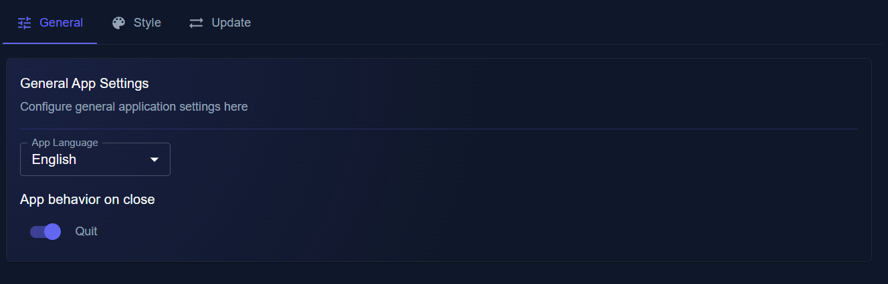

  <ol>
    <li>
      App Language
    </li>
    <ul>
      <li>
        Choose the app language for the frontend
      </li>
      <li>
        This does not change any commands or messages. Commands an messages are loaded in dependency of your machine. 
      </li>
    </ul>
    <li>
      App behavior on close
    </li>
    <ul>
      <li>
        Set the state if the app does quit or minimize on close.
      </li>
    </ul>
  </ol>

##

### Style

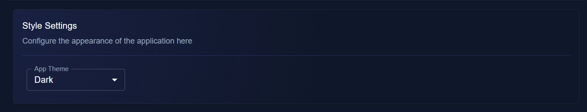

  <ol>
    <li>
      App Theme
    </li>
    <ul>
      <li>
        Choose the theme for the frontend
      </li>
    </ul>
  </ol>

##

### Update

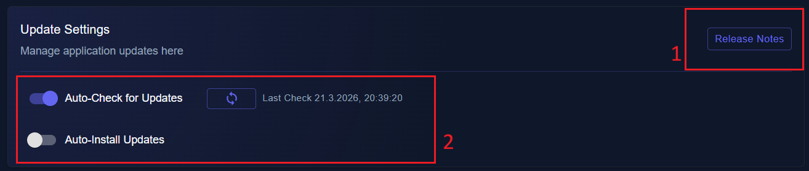

  <ol>
    <li>
      Release Notes
    </li>
    <ul>
      <li>
        Opens the release notes for the current installed version of the app in your main browser on your machine
      </li>
    </ul>
    <li>
      Auto-Check for Update
    </li>
    <ul>
      <li>
        On app start the app called the update server and searches for an possible update. If an update was found, the release notes are shown in a window. In this window you are able to decide if you want to update the application
      </li>
    </ul>
    <li>
      Auto-Install Updates
    </li>
    <ul>
      <li>
        The app installs updates automatically if one is found. The installation runs on app start.
      </li>
    </ul>
    <li>
      Manual check for Updates
    </li>
    <ul>
      <li>
        Trigger manual a check if a update is available and open a information it is or not
      </li>
      <li>
        After each check (automatic or manual doesn't matter), the timestamp are saved and displayed in the label
      </li>
    </ul>
  </ol>

##

### Backup

- Create or import a backup from all settings
- Switch states only for export settings
- Import always a full import for all data are created on export. Switch states does not effect it

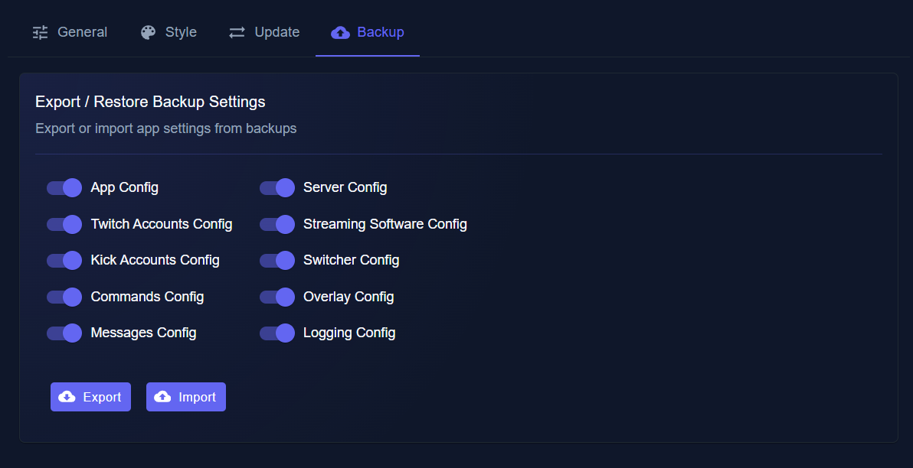

- Choose the settings to export
- Export or import button opens the save or load dialog

</details>

---

# HELP ME

## Here you can find the most asked questions from the community and found maybe some help for your problem

  <table>
    <thead>
      <tr>
        <th>PROBLEM</th>
        <th>POSSIBILITIES</th>
        <th>POSSIBLE SOLUTIONS</th>
      </tr>
    </thead>
    <tbody>
      <tr>
        <td>The switcher doesn't start to switch</td>
        <td>
          <ul>
            <li>
              The broadcasting software is not in a switchable scene
            </li>
            <li>
              The broadcasting software is not connected to the switcher
            </li>
            <li>
              No stream feed stats served by the server
            </li>
          </ul>
        </td>
        <td>
          <ul>
            <li>
              Manually bring the broadcasting software in a switchable scene (switch scene command). Only scenes in your switcher settings are switchable scenes! 
            </li>
            <li>
              Check your connection setup (Websocket is up running? Connection settings correct?) or restart the broadcasting software
            </li>
            <li>
              Check the server connection. If no live data are shown up in the Feed-Chart on the dashboard, the server does not send data or the setup is wrong and the app can not listen to the server stats
            </li>
          </ul>
        </td>
      </tr>
      <tr>
        <td>After authorization i got a "server not reachable" or "cannot get /oauth/..." in my browser window</td>
        <td>
          <ul>
            <li>
              The firewall or defender block the incoming data
            </li>
          </ul>
        </td>
        <td>
          <ul>
            <li>
              Check your firewall or defender settings and make sure the app is authorized to get incoming messages</td>
            </li>
          </ul>
      </tr>
    </tbody>
  </table>

# Roadmap

- ✅ Add a overlay served by the app to display the feed stats in the broadcasting software
- ✅ Add a Backup / Import function
- ✅ Add a logging functionality to save session / actions logs
- Add a option for full managed app versions
- Add more different server types
- Add more broadcasting softwares
- Add more platforms (if there are more relevant in future)
- Find some translators to add more languages to the application
- Get community feedback and make the app well for them
